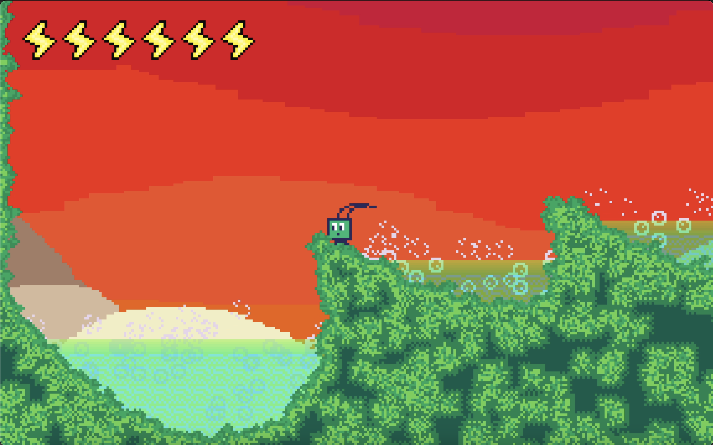
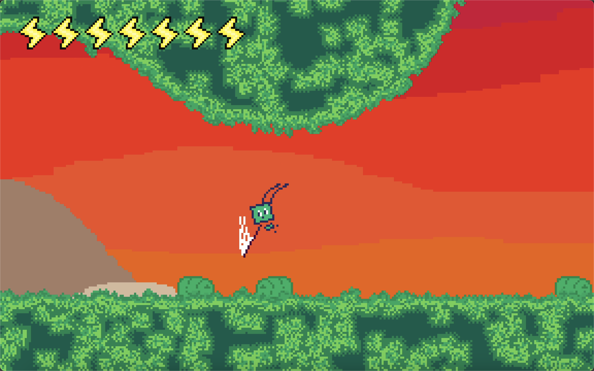
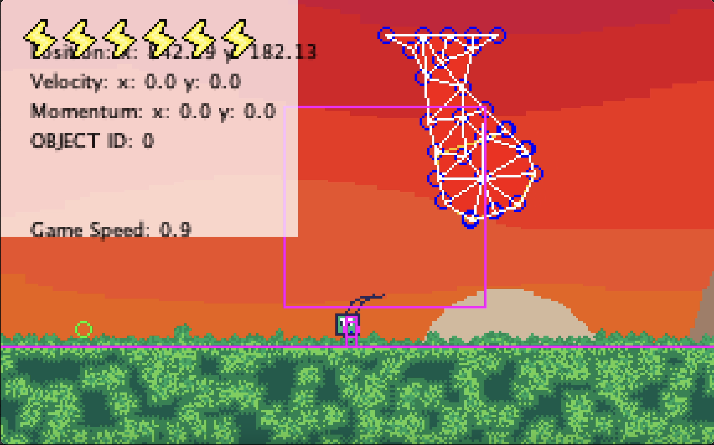
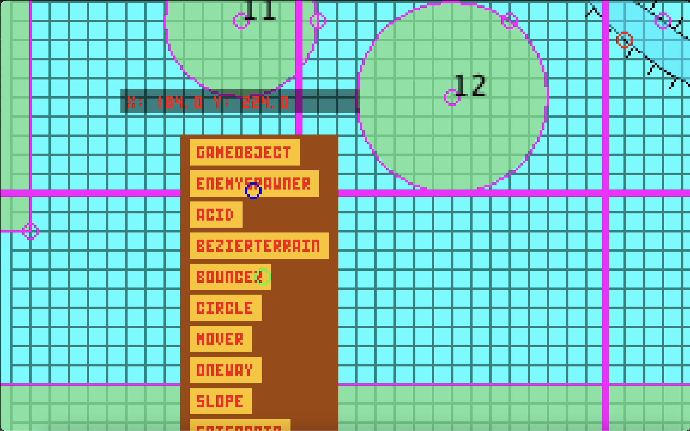

# Symbio

A 2D action-platformer built entirely from scratch in Java, set inside the human body. You play as a microscopic robot navigating biological environments made of soft, physically-simulated tissue. No external libraries or engines were used. Everything, including the physics, collision, rendering, and level editor, is custom-built.

<video src="https://github.com/gregparamonau/Symbio/raw/master/symbio_game.mp4" controls width="100%"></video>



---

## Overview

The main loop runs in `Game.game()` at a fixed 60fps target. Each frame, game objects update, enemies update, the player updates, the camera moves, and the next frame is rendered to an off-screen buffer that gets swapped to screen. Rendering uses double-buffered `BufferedImage` swapping via `Start.count % 2`, so one image is being drawn to while the other is displayed.

---

## Player Movement

The player movement system is state-machine based, with four states: **Ground**, **Air**, **Dash**, and **WallSlide**. Each state manages its own input handling, physics parameters, and transitions to other states.

The player has two separate velocity vectors: `vel`, which is input-driven, and `momentum`, which carries over from dashes and impacts. Both are summed when moving the player each frame, but `momentum` decays independently of `vel`.

**Jump** - variable height jump. Holding jump floats the player at the apex. Gravity switches between `gravity_normal`, `gravity_heavy`, and `gravity_light` depending on input and jump state. Coyote time and jump buffering are both implemented.

**Dash** - 8-directional dash with a brief input buffer window after the input to let the player choose direction. On exit, the dash velocity is converted into `momentum` via `end_dash()`, which persists and decays separately from normal velocity, allowing the player to carry speed out of a dash.

**Wall Slide** - the player grabs walls and slides slowly downward. Wall jumping is directional depending on what the player is holding: away from the wall, toward the wall, or straight up. A direction buffer gives the player a few frames to decide before the jump fires.

**Bunny Hop** - landing shortly after a jump preserves and amplifies horizontal momentum, rewarding continuous movement.

---

## Combat



**Slash** - 4-directional attack with a direction buffer window after the input fires, giving the player a few frames to aim. Hit detection uses a rectangular hitbox offset from the player in the slash direction.

**Pogo** - a downward slash that bounces the player upward on hit. Gravity is reduced during the float phase, giving it a satisfying floaty feel.

**Knockback** - successfully hitting an enemy applies a velocity impulse to the player in the opposite direction of the slash, and refills the dash count. This lets the player chain combos through the air by bouncing between enemies.

**Health** - the player has a pool of health bolts shown on the HUD. Taking damage triggers invincibility frames and a knockback impulse. Death respawns the player at the last touched checkpoint.

---

## Soft Body Physics



The main technical system in the game. Soft bodies are deformable mesh objects that make up the biological terrain and obstacles throughout the levels.

### Structure

Each `SoftBody` consists of nodes, springs, frames, and rest positions.

**Nodes** are point masses with position, velocity, and force vectors. They can be `"node"` (fully simulated), `"fixed"` (immovable, treated as infinite mass in collision), or `"hook"` (internal anchor used for shape memory).

**Springs** connect pairs of nodes with a rest length and spring constant `k`. Damping is applied proportional to the relative velocity of the two nodes along the spring axis.

**Frames** are subsets of nodes that define shape-memory regions within the body. Each frame has its own centroid (`poss[x]`) and orientation angle (`angles[x]`), both recomputed every frame from the current node positions.

**Rest positions** - each frame maintains a `rest_pos` array, which is the current rotated and translated target shape, and a `base_rest_pos` array, which stores the canonical unrotated offsets from the frame centroid. Hook springs pull frame nodes toward their corresponding `rest_pos` targets each frame.

### Simulation Loop

Each frame the soft body applies gravity to all `"node"` type nodes, then runs N substeps of spring force integration for numerical stability at higher `k` values. After the substep loop, it resolves collisions with terrain and other soft bodies, then runs `configure()`, which recomputes the centroid and rotation angle for each frame and updates `rest_pos` accordingly.

### Shape Memory

`configure()` calls `find_orientation()`, which computes a weighted average rotation angle for each frame using dot products and signed angles against `base_rest_pos`. `change_orientation()` then rotates the hook targets to match that angle, making the body resist deformation and spring back toward its original shape over time.

### File Format

Soft bodies can be loaded from text files. The format is:

```
[total nodes] [external nodes] [frames] [springs] [default mass] [default k]
[type] [x] [y]           <- one line per node (type: node / fixed)
...
[i0] [i1] [i2] ...       <- one line per frame (space-separated node indices)
...
[a] [b] (optional k)     <- one line per spring
...
```

Node coordinates need to be specified relative to the centroid of the non-fixed external nodes, meaning they should average to zero. If they don't, there will be a mismatch between the centroid computed at construction time and the one `find_pos()` computes at runtime, which causes a spurious launch force on the first frame.

### Collision

Soft body vs soft body collision works by iterating over each external node of body A and checking if it is inside body B's polygon. If it is, the nearest point on B's boundary is found, and positions and velocities are corrected using mass-weighted impulse resolution. Fixed nodes on either side are treated as infinite mass, so they don't move but still fully deflect the colliding node.

Player vs soft body collision is handled by `displace_player()`, which finds the closest edge to the player, pushes them out along the edge normal, and exchanges velocity using impulse-based resolution weighted by the respective masses.

---

## Rendering

`Camera.draw_view()` renders each frame in this order: parallax background layers (each scrolling at a different fraction of camera speed), soft body terrain drawn behind everything else, the player, enemies, other game objects and their collision polygons, debug overlays if `debug_mode` is on (velocity and momentum vectors, bounding boxes, respawn point), and finally the HUD.

The camera follows the player using an arctan-based easing function that moves quickly when the player is far and slows as it catches up. It is clamped to room bounds and centers itself if the room is smaller than the viewport. Screen shake is also supported.

The game renders at a fixed low resolution scaled up by `pixel_size` (default 5x), giving it a pixel art look.

---

## Level Editor



A separate editing mode with two sub-editors. **GameEditor** is the overall map view, where rooms are shown as rectangles and can be added and positioned on a grid. **RoomEditor** lets you edit the contents of a single room, placing, moving, and configuring game objects. Text input for object properties is handled via a dialog system (`OptionPane`).

Arrow keys scroll the view, `P` saves and exits, and `S` saves to a backup file.

### Data Format

All level data is stored in a single flat text file (`save_game.txt` in `~/DATA_FILES/`). Rooms are stored sequentially, each with a header line for the room bounds, a count of objects, and one line per object. `DataManager` handles reading, writing, inserting, and skipping rooms by index. Rooms are loaded on demand when the player transitions between them.

---

## Game Objects and Spawning

Game objects are defined in `GameObject` and its subclasses. Each object has a type string that determines which subclass gets instantiated via `GameObject.create_game_object()`. Objects are stored in `Room.objects[]` and updated and drawn each frame.

The two most important object types are **SBTerrain**, which is a soft body loaded from a file with collision and optional attachment to a Mover, and **Mover**, which moves along a path and can carry soft bodies or other objects. Objects can reference each other via `object_handle` indices, which is how movers drive terrain.

Enemies are stored separately in `Room.enemies[]` and implement their own update and draw methods. They respond to the player's slash hitbox via `damage()`, which returns whether the hit landed and triggers the player's knockback if so.

---

## Animations

The `Animation` class manages sprite sheets. All sprites are loaded into a global 2D array `Animation.global_sprites[index_start][frame]`. Animations track a current frame index, playback speed, and whether they loop.

`PlayerRender` selects the correct animation based on the current movement state (running, jumping, dashing, wall sliding, slashing) and draws it at the player's position through the camera transform.

---

## Building

Requires Java 11+. Import as an Eclipse project or compile from `src/` directly. No external dependencies. The entry point is `Main.Start`, which on launch presents a menu to start the game or open the level editor.
